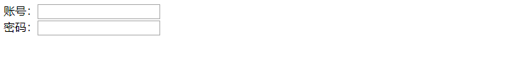
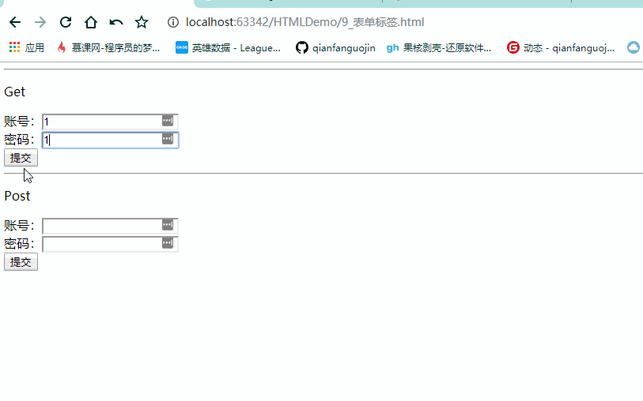
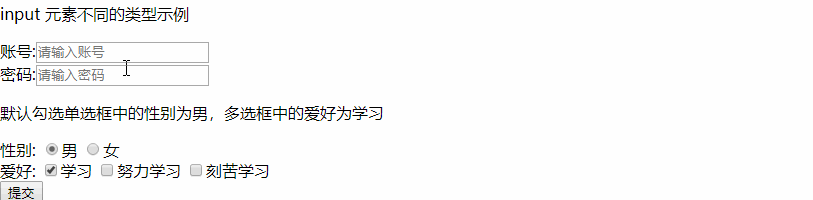
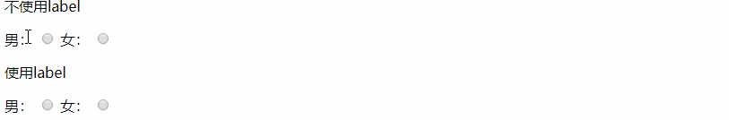
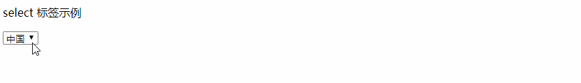
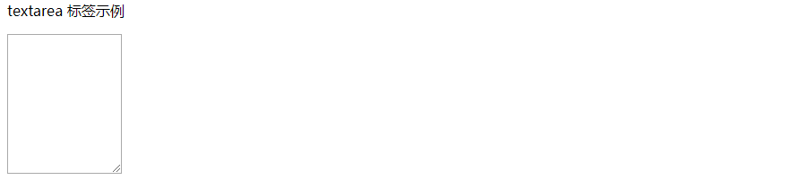

## 前言

上篇文章主要介绍了HTML的一些基本标签的使用，这些标签如何使用美化和我们后端来说都没有很大的关系，我们关心的更多的是数据的交互。

这篇文章就来介绍我们后端关注的HTML中一个重要的标签：**表单`<form>`** 标签

<!--more-->

## 1. 什么是表单

概念：用于采集用户输入的数据，用于和服务器进行交互。

最明显的一个例子就是登陆注册页面，用户登陆时在表单中填写数据，然后表单通过 get / post 等方式将数据发给服务器进行登陆的操作。

---

## 2 快速使用

一个简单的表单：

```html
<form>
    账号：<input><br/>
    密码：<input>
</form>
```

效果如下：



显示两个 input 框，默认输入为文本类型元素。

------

## 3. 与表单有关的标签详解

### 3.1 表单范围`<form>`标签

`<form></form> `定义一个表单范围，元素中的数据只有在 form 标签中才会被提交。


属性解析：

**action：** 指定表单要提交到的路径（URL）。

**method：**提交表单时的方式，常用的有一下两种：

- 第一种：Get    速度更快，提交的数据会在地址栏显示，通过 & 拼接显示，封装在请求行中，不太安全。

- 第二种：Post  提交的数据不会在地址栏显示。封装在请求体中，更安全。

  示例：

  ```html
  <!--get post示例-->
  <p>Get</p>
  <form method="get">
  
      账号：<input name="username"><br/>
      密码：<input name="password"><br/>
           <input type="submit">
  </form>
  <hr/>
  <p>Post</p>
  <form method="post">
  
      账号：<input name="username"><br/>
      密码：<input name="password"><br/>
           <input type="submit">
  </form>
  ```

  效果展示：

  

### 3.2 表单输入`<input>`标签

`<input>` 定义表单中的输入元素，根据指定不同的类型可以显示不同的功能，包括文本字段、复选框、单选框、提交按钮等。


属性解析：

**name：** 指定该input元素的名字，每个input名字唯一，服务器接收到表单通过name属性区别表单中不同的input元素

**value：**指定该input元素的默认值。

**type：** 指定该input元素的类型。

<span style="color:blue">基本类型：</span>

- **text ：**输入文本 (默认类型) 。

- **password：**输入密码，输入的数据会被特殊字符代替。

  > - 通过指定输入框的 placeholder 属性值可以实现输入提示，提示会在输入字段为空时显示，并会在字段获得焦点时消失。

- radio：单选框，

- checkbox：复(多)选框。

  > - 指定 type 为 radio 或者 checkbox 的input元素 `name` 属性必须相同，且必须设置 value 属性的值来区别不同的选项。
  > - 可以通过设置 input 元素的 checked 属性来给设定某个选项默认被选中。

  一个示例：

  ```html
  <!--input 元素类型解析-->
  <p>input 元素不同的类型示例</p>
  <form method="get">
      账号:<input name="username" placeholder="请输入账号"><br/>
      密码:<input type="password" name="password" placeholder="请输入密码"><br/>
      <!--使用radio单选框时，选项的name属性必须一样-->
      
      <p>默认勾选单选框中的性别为男，多选框中的爱好为学习</p>
      性别:
      <input type="radio" name="sex" checked>男
      <input type="radio" name="sex">女<br/>
      爱好:
      <input type="checkbox" name="hobbies" checked>学习
      <input type="checkbox" name="hobbies">努力学习
      <input type="checkbox" name="hobbies">刻苦学习<br/>
  
      <input type="submit">
  </form>
  ```

  效果展示：

  


<span style="color:blue">更多类型：</span>

- file: 文件上传按钮。
- **submit：**提交表单按钮。
- button：简单的按钮，默认没有任何实现效果。
- **image：**定义图像类型的提交按钮，点击该图像，表单会被提交。
- hidden：定义一些隐藏字段，在浏览器上不显示任何效果。

<span style="color:blue">HTML5中新增类型：</span>

- color: 取色器。
- **data：**定义 date 控件（包括年、月、日，不包括时间）。
- **datetime-local：**定义 date 和 time 控件（包括年、月、日、时、分、秒、几分之一秒，不带时区）。


### 3.3 文字描述`<label>`标签

`<label>` 标签可以实现对 input 元素定义标注（标记）。通过 label 标签将 input 元素前的文字包裹起来，再将 label 标签中 `for` 属性值与 input 元素中的 id 属性值对应，此时点击 input 元素前的文本可以使 input 元素获得焦点。

属性解析：

- **for：**指定此 label 元素所关联的元素属性 id 值。点击该 label 元素会让具有该 id 值的元素获得焦点。

示例：

```html
<!--label 标签示例-->
<form>
    <p>不使用label</p>
    男：
    <input type="radio" name="sex">
    女：
    <input type="radio" name="sex"><br/>


    <p>使用label</p>
    <label for="male">男：</label>
    <input type="radio" name="sex" id="male">
    <label for="female">女：</label>
    <input type="radio" name="sex" id="female"><br/>

</form>
```

效果展示：



### 3.4 下拉列表`<select>`标签

`<select>` 标签用来创建下拉列表。

在`<select>` 标签中，使用`<option>`标签来标识每一个下拉列表的选项。

属性解析：

`<seclect>`标签属性

- **name：**指定其name属性值可作为与服务器交互数据的HTML元素的服务器端的标示，我们可以在服务器端根据其Name取得元素提交的值。

`<option>`标签属性

- **value：**该属性值指定下拉列表被送往服务器的内容。通过该值给下拉列表中不同的选项指定值，以让服务器接收到对选择的选项进行判定。

演示示例：

```html
<!--select标签示例-->
<p>select 标签示例</p>
<form>
    <select name="country" id="country">
        <option value="0">中国</option>
        <option value="1">美国</option>
        <option value="2">法国</option>
        <option value="3">英国</option>
    </select>


</form>
```

效果展示：




### 3.5 文本域`<textarea>`标签

`<textarea>` 标签定义一个多行的文本输入控件，可以容纳无限数量的文本，一般使用在一些填写详细信息或者大容量文本的地方。

属性解析：

- **cols：**规定文本输入控件的可见列数。

- **rows：**规定文本输入控件的可见行数（不够会自动扩容）。

  > 这两个属性值在不同的浏览器中显示不一样，敬请参考：https://www.zhangxinxu.com/wordpress/2016/02/html-textarea-rows-height/

演示示例：

```html
<!--textarea标签示例-->
<p>textarea 标签示例</p>
<form>
    <!--15行(cols)15列(rows)-->
    <textarea cols="15" rows="10" name="text">

    </textarea>


</form>
```

效果展示：

