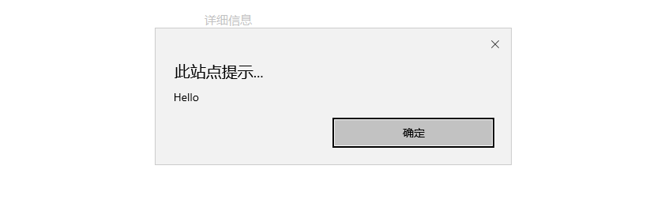
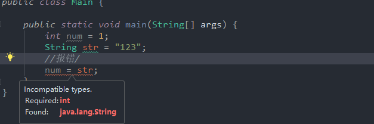
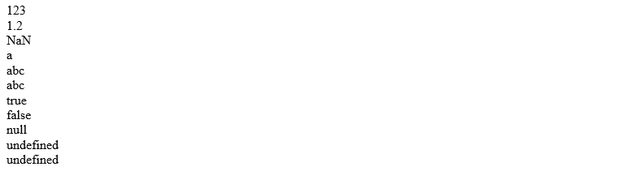
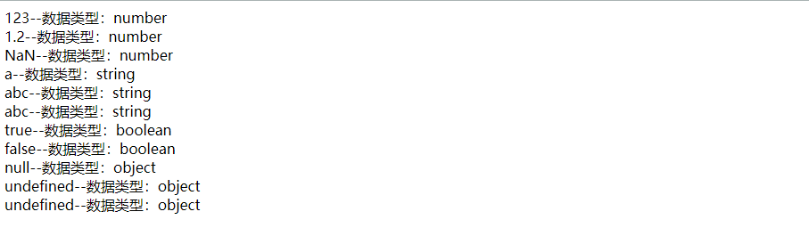

## 前言

在前面的文章中，我们介绍了JavaScript心酸的发展历程，从开始的大乱斗，到后来的标准化....。

目前我们所用的 JavaScript 是由三部分内容组成的：**ECMAScript(标准) + DOM(文档对象) +BOM(浏览器对象)**。 

JavaScript 的基本语法和基本对象等都是来自于 ECMAScript 的 ,可以说 ECMAScript是JavaScript的一部分。

在学习 JavaScript时，我们先从ECMAScript中开始讲起。

在ECMAScript中，主要包含以下内容：

1. 基本语法
   - 与html的结合方式。
   - 注释使用方式。
   - 数据类型。
   - 变量。
   - 运算符。
   - 流程控制语句。
2. 基本对象


## 基本语法

JavaScript的语法和Java由许多近似之处，所以如果你是一个有过Java基础的同学，学起来其实并不会很累。

### 1. JavaScript与HTML的结合方式

与CSS代码一样，JavaScript的代码也有多种方式可以和html进行结合：

不管是什么方式结合，在html中声明JavaScript的方式都是通过`<script></script>`标签。声明JS的两种方式如下：

- 内部JS，JavaScript 代码直接写在html文件内，在`<script>`标签内编写JS代码。

  示例：

  ```html
  <body>
      <!-- alert() 方法用于显示带有一条指定消息和一个确定按钮的警告框。 -->
      <script>
      alert("Hello");
      </script>
   
  </body>
  ```

  运行结果：

  

  这是Chrome浏览器的显示效果，在不同的浏览器中显示样式不同，但是效果都是一个警告框。

  在MicroSoft的edge浏览器上，显示效果为：

   

- 外部JS，JavaScript 代码编写在独立的后缀为`.js`的文件中，通过` <script></script>`标签中的 `src` 属性进行引用。 

  示例：

  新建一个 `js`文件夹用于存放所有的 `js` 文件，然后新建一个名为`js_combine.js`的文件，将以下内容粘贴： 
  
  ```javascript
  alert("外部的Hello")
  ```
  
  然后在html的`<script>`标签中引用该文件：
  
  ```html
  <!-- alert() 方法用于显示带有一条指定消息和一个确定按钮的警告框。 -->
      <script src="./js/js_combine.js">
      </script>
  ```
  
  运行结果：
  
  

<span style="color:red">**注意事项：**</span>

1. `<script>`标签的声明可以在html的任何位置，包括`<html></html>`标签外。
2. `<script>`标签声明的位置会影响 js 代码执行的时刻。js代码的执行和html元素的渲染是在同一个序列中，在html的解析中，碰到`<script>`标签就会去执行。
3. `<script>`标签声明在`<html></html>`标签外时，浏览器会优先执行该`<script>`标签中的内容。
4. 当我们要使用 js 修改 html 元素时，我们应将 js 代码声明在`<html></html>`标签内且在最下方，这个位置代表前面的html元素已经渲染完成，此时修改html元素才为最佳。


### 2. JavaScript注释

每一种语言都拥有注释的功能，JavaScript的注释的使用方法和Java近似，分为以下两种：

- 单行注释，和Java一样使用 `//`

- 多行注释，也和Java一样，使用`/*....*/`

  例子：

  ```html
  <body>
      <script>
          //单行注释    
          
          /*
              多
              行
              注
              释
          */     
      </script>
  </body>
  ```


### 3. JavaScript变量&数据类型

#### 3.1强类型语言和弱类型语言

强类型语言，它不允许隐式变量类型转换，变量在在定义时确定数据类型，变量所处的内存空间就只能存储该数据类型的值。

Java 就是一种强类型语言。你会发现，我们如果在java代码中声明了一个变量为整型，那么其肯定不能赋值为字符串：




与强类型语言相对的就是弱类型语言，弱类型语言的变量允许隐式变量类型转换，变量在定义时没有明确的数据类型，变量所处的内存空间可以存储多种数据类型的值。

JavaScript就是一种弱类型语言。使用JavaScript将字符串转为数字类型非常简单：

```javascript
var str = “123”;
//直接进行赋值操作即可将str的数据类型转换为数字类型
str = 111;

/*

*/
```

在弱类型语言中，变量的类型不固定，你想让其成为什么类型，它就能成为什么类型，语言的解释器会自动将数据类型进行隐式转换。

#### 3.2 JavaScript数据类型

和Java一样，在JavaScript中也将数据类型分为两个种类，一类是原始数据类型（基本数据），一类是引用数据类型。它们的内容如下：

- 原始数据类型
  - number  数字类型。包括整数，小数 ，以及一个特殊数**NaN**(Not a Number : 不是数字)。
  - string      字符串类型。包括字符/字符串 ，声明时使用 "123" 和 '123' 都是可行的。
  - boolean  布尔类型。 true 或 false
  - null           对象为空，其实是个Bug。
  - undefined   未定义。 当变量定义时没有默认值，变量的数据类型为undefined，变量值为undefined 
- 引用数据类型
  - 基本对象、BOM对象、DOM对象。

关于数据类型的介绍我们到变量内容中来逐一介绍，现在我们只要知道有这些数据类型就可以了。

#### 3.3 JavaScript变量

在JavaScript中，由于JavaScript为弱类型语言，变量定义无需指定数据类型，统一用`var`来表示。定义一个变量的语法格式为：

```javascript
var 变量名 = 初始化值;
```

下面是相应数据类型的变量定义：

```javascript
        //定义 number 数字类型 ，包括整数，小数 ，以及一个特殊数NaN(Not a Number : 不是数字)。
        var num1 = 123;
        var num2 = 1.2;
        var num3 = NaN;
        
        //定义 string  字符串类型。包括字符/字符串 ，声明时使用 "123" 和 '123' 都是可行的。
        var str1 = "a"
        var str2 = "abc";
        var str3 = 'abc';

        //定义 boolean  布尔类型。 true 或 false
        var bol1 = true;
        var bol2 = false;

        //定义 null 
        var obj1 = null;

        //定义undefined 当变量定义时没有默认值，变量的数据类型为undefined，变量值为undefined
        var ud1;
        var ud2;
```

也可以使用`document`对象将这些变量打印到网页上：

```javascript
				//使用document对象中的write方法将变量逐个输出网页上显示
        document.write(num1 + "<br/>");
        document.write(num2 + "<br/>");
        document.write(num3 + "<br/>");
        document.write(str1 + "<br/>");
        document.write(str2 + "<br/>");
        document.write(str3 + "<br/>");
        document.write(bol1 + "<br/>");
        document.write(bol2 + "<br/>");
        document.write(obj1 + "<br/>");
        document.write(ud1 + "<br/>");
        document.write(ud2 + "<br/>");
```

输出结果和上面对应：



#### 3.4 使用typeof运算符判断变量的数据类型

在刚才的示例中，我们知道，JavaScript的变量都由`var`关键字进行定义，而且变量可以赋值为多种数据类型，但是这样的定义就出现了一个问题：

在Java中，我们定义不同数据类型的变量时要使用不同关键字，如字符串使用String，整型使用 int，这样我们在使用时可以很轻松的知道某个变量的数据类型。

而在JavaScript中，定义变量时并不指定数据类型，都使用 `var` 关键字，我们无法直接判断出某个变量的数据类型。

为了应对这个问题，在JavaScript中提供了一个运算符 **typeof** 用来判断某个变量的数据类型，其语法格式为：

```javascript
typeof(变量名);
```

**typeof** 运算符执行后会返回一个字符串类型的变量，描述该变量的数据类型。

为了演示 **typeof** 运算符的效果，我们修改上面`document`对象打印内容的代码，在每个变量打印时添加 **typeof**判断后的内容：

```js
				//使用document对象中的write方法逐个输出网页上显示，同时显示它们对应的数据类型
        document.write(num1 + "--数据类型：" + typeof(num1) + "<br/>");
        document.write(num2 + "--数据类型：" + typeof(num2) + "<br/>");
        document.write(num3 + "--数据类型：" + typeof(num3) + "<br/>");
        document.write(str1 + "--数据类型：" + typeof(str1) + "<br/>");
        document.write(str2 + "--数据类型：" + typeof(str2) + "<br/>");
        document.write(str3 + "--数据类型：" + typeof(str3) + "<br/>");
        document.write(bol1 + "--数据类型：" + typeof(bol1) + "<br/>");
        document.write(bol2 + "--数据类型：" + typeof(bol2) + "<br/>");
        document.write(obj1 + "--数据类型：" + typeof(obj1) + "<br/>");
        document.write(ud1 + "--数据类型：" + typeof(obj1) + "<br/>");
        document.write(ud2 + "--数据类型：" + typeof(obj1) + "<br/>");
```

输出结果为：



可以看到每个变量的数据类型都对应相应的名称，但是