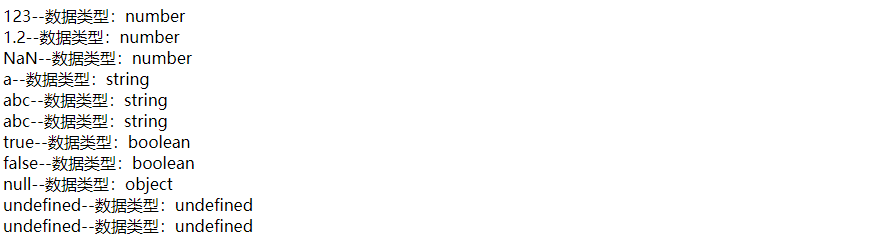

## 前言

在前面的文章中，我们介绍了JavaScript心酸的发展历程，从开始的大乱斗，到后来的标准化....。

目前我们所用的 JavaScript 是由三部分内容组成的：**ECMAScript(标准) + DOM(文档对象) +BOM(浏览器对象)**。 

JavaScript 的基本语法和基本对象等都是来自于 ECMAScript 的 ,可以说 ECMAScript是JavaScript的一部分。

在学习 JavaScript时，我们先从ECMAScript中开始讲起。

在ECMAScript中，主要包含以下内容：

1. 基本语法
   - 与html的结合方式。
   - 注释使用方式。
   - 数据类型。
   - 变量。
   - 运算符。
   - 流程控制语句。
2. 基本对象


## 基本语法介绍

JavaScript的语法和Java由许多近似之处，所以如果你是一个有过Java基础的同学，学起来其实并不会很累。

### 1. JavaScript与HTML的结合方式

与CSS代码一样，JavaScript的代码也有多种方式可以和html进行结合：

不管是什么方式结合，在html中声明JavaScript的方式都是通过`<script></script>`标签。声明JS的两种方式如下：

- 内部JS，JavaScript 代码直接写在html文件内，在`<script>`标签内编写JS代码。

  示例：

  ```html
  <body>
      <!-- alert() 方法用于显示带有一条指定消息和一个确定按钮的警告框。 -->
      <script>
      alert("Hello");
      </script>
   
  </body>
  ```

  运行结果：

  

  这是Chrome浏览器的显示效果，在不同的浏览器中显示样式不同，但是效果都是一个警告框。

  在MicroSoft的edge浏览器上，显示效果为：

   

- 外部JS，JavaScript 代码编写在独立的后缀为`.js`的文件中，通过` <script></script>`标签中的 `src` 属性进行引用。 

  示例：

  新建一个 `js`文件夹用于存放所有的 `js` 文件，然后新建一个名为`js_combine.js`的文件，将以下内容粘贴： 
  
  ```javascript
  alert("外部的Hello")
  ```
  
  然后在html的`<script>`标签中引用该文件：
  
  ```html
  <!-- alert() 方法用于显示带有一条指定消息和一个确定按钮的警告框。 -->
      <script src="./js/js_combine.js">
      </script>
  ```
  
  运行结果：
  
  

<span style="color:red">**注意事项：**</span>

1. `<script>`标签的声明可以在html的任何位置，包括`<html></html>`标签外。
2. `<script>`标签声明的位置会影响 js 代码执行的时刻。js代码的执行和html元素的渲染是在同一个序列中，在html的解析中，碰到`<script>`标签就会去执行。
3. `<script>`标签声明在`<html></html>`标签外时，浏览器会优先执行该`<script>`标签中的内容。
4. 在默认情况下，当我们要使用 js 修改 html 元素时，我们应将 js 代码声明在`<html></html>`标签内且在最下方，这个位置代表前面的html元素已经渲染完成，此时修改html元素才为最佳。


### 2. JavaScript注释

每一种语言都拥有注释的功能，JavaScript的注释的使用方法和Java近似，分为以下两种：

- 单行注释，和Java一样使用 `//`

- 多行注释，也和Java一样，使用`/*....*/`

  例子：

  ```html
  <body>
      <script>
          //单行注释    
          
          /*
              多
              行
              注
              释
          */     
      </script>
  </body>
  ```


### 3. JavaScript变量&数据类型

#### 3.1强类型语言和弱类型语言

强类型语言，它不允许隐式变量类型转换，变量在在定义时确定数据类型，变量所处的内存空间就只能存储该数据类型的值。

Java 就是一种强类型语言。你会发现，我们如果在java代码中声明了一个变量为整型，那么其肯定不能赋值为字符串：


与强类型语言相对的就是弱类型语言，弱类型语言的变量允许隐式变量类型转换，变量在定义时没有明确的数据类型，变量所处的内存空间可以存储多种数据类型的值。

JavaScript就是一种弱类型语言。使用JavaScript将字符串转为数字类型非常简单：

```javascript
var str = “123”;
//直接进行赋值操作即可将str的数据类型转换为数字类型
str = 111;

/*

*/
```

在弱类型语言中，变量的类型不固定，你想让其成为什么类型，它就能成为什么类型，语言的解释器会自动将数据类型进行隐式转换。

#### 3.2 JavaScript数据类型

和Java一样，在JavaScript中也将数据类型分为两个种类，一类是原始数据类型（基本数据），一类是引用数据类型。它们的内容如下：

- 原始数据类型
  - number  数字类型。包括整数，小数 ，以及一个特殊数**NaN**(Not a Number : 不是数字)。
  - string      字符串类型。包括字符/字符串 ，声明时使用 "123" 和 '123' 都是可行的。
  - boolean  布尔类型。 true 或 false
  - null           对象为空，其实是个Bug。
  - undefined   未定义。 当变量定义时没有默认值，变量的数据类型为undefined，变量值为undefined 
- 引用数据类型
  - 基本对象、BOM对象、DOM对象。

关于数据类型的介绍我们到变量内容中来逐一介绍，现在我们只要知道有这些数据类型就可以了。

#### 3.3 JavaScript变量

在JavaScript中，由于JavaScript为弱类型语言，变量定义不指定数据类型，统一用`var`关键字来定义。定义一个变量的语法格式为：

```javascript
var 变量名 = 初始化值;
```

下面是相应数据类型的变量定义：

```javascript
<script>
				//定义 number 数字类型 ，包括整数，小数 ，以及一个特殊数NaN(Not a Number : 不是数字)。
        var num1 = 123;
        var num2 = 1.2;
        var num3 = NaN;
        
        //定义 string  字符串类型。包括字符/字符串 ，声明时使用 "123" 和 '123' 都是可行的。
        var str1 = "a"
        var str2 = "abc";
        var str3 = 'abc';

        //定义 boolean  布尔类型。 true 或 false
        var bol1 = true;
        var bol2 = false;

        //定义 null 
        var obj1 = null;

        //定义undefined 当变量定义时没有默认值，变量的数据类型为undefined，变量值为undefined
        var ud1 = undefined;
        var ud2;
</script>
```

也可以使用`document`对象将这些变量打印到网页上，在代码中添加：

```javascript
				//使用document对象中的write方法将变量逐个输出网页上显示
        document.write(num1 + "<br/>");
        document.write(num2 + "<br/>");
        document.write(num3 + "<br/>");
        document.write(str1 + "<br/>");
        document.write(str2 + "<br/>");
        document.write(str3 + "<br/>");
        document.write(bol1 + "<br/>");
        document.write(bol2 + "<br/>");
        document.write(obj1 + "<br/>");
        document.write(ud1 + "<br/>");
        document.write(ud2 + "<br/>");
```

输出结果和上面对应：


<span style="color:red">注意：</span>

1. 在JavaScript中，您可以同时声明两个相同的变量，而且不会报错，如：

   ```javascript
   var x = 4;
   var x = 5;
   ```

   但是在内存中只存在于一个变量名的内存空间：

   > JavaScript 从来不会告诉你是否多次声明了同一个变量，遇到这种情况，它只会对后续的声明视而不见（不过，它会执行后续声明中的变量初始化）

   也就是说，上面的语句等效于：

   ```javascript
   var x = 4;
   x = 5;
   ```

2. 每个函数内的局部变量可以相同，而且函数与函数之间不受影响。

3. 在函数中的变量名和全局变量名重名时，函数内使用局部变量。


#### 3.4 使用typeof运算符判断变量的数据类型

在刚才的示例中，我们知道，JavaScript为弱类型语言，变量的定义声明都使用`var`关键定，而且变量可以自由变换为多种数据类型，变量的使用变的非常的简便。但是这样的设定存在一个问题：

在Java中，我们定义不同数据类型的变量时要使用不同的关键字，如字符串使用String，整型使用 int，这样我们在使用时可以很清楚的知道某个变量的数据类型。

而在JavaScript中，定义变量时并不指定数据类型，都使用 `var` 关键字，我们无法直接判断出某个变量的数据类型。

为了应对这个问题，在JavaScript中提供了一个运算符 **typeof** 用来判断某个变量的数据类型，其语法格式为：

```javascript
typeof(变量名);
```

**typeof** 运算符执行后会返回一个字符串类型的变量，描述该变量的数据类型。

为了演示 **typeof** 运算符的效果，我们修改上面`document`对象打印内容的代码，在每个变量打印时添加 **typeof**判断后的内容：

```js
				//使用document对象中的write方法逐个输出网页上显示，同时显示它们对应的数据类型
        document.write(num1 + "--数据类型：" + typeof(num1) + "<br/>");
        document.write(num2 + "--数据类型：" + typeof(num2) + "<br/>");
        document.write(num3 + "--数据类型：" + typeof(num3) + "<br/>");
        document.write(str1 + "--数据类型：" + typeof(str1) + "<br/>");
        document.write(str2 + "--数据类型：" + typeof(str2) + "<br/>");
        document.write(str3 + "--数据类型：" + typeof(str3) + "<br/>");
        document.write(bol1 + "--数据类型：" + typeof(bol1) + "<br/>");
        document.write(bol2 + "--数据类型：" + typeof(bol2) + "<br/>");
        document.write(obj1 + "--数据类型：" + typeof(obj1) + "<br/>");
        document.write(ud1 + "--数据类型：" + typeof(ud1) + "<br/>");
        document.write(ud2 + "--数据类型：" + typeof(ud2) + "<br/>");
```

输出结果为：



可以看到每个变量的数据类型都对应相应的名称，但是注意一个变量值null，其使用**typeof**得出的是object (对象) 数据类型。但是我们在前面提过 null 和 undefined 一样，是一种原始数据类型，null值对应的数据类型应该是 `nul`l。 

要解释这个问题比较复杂，其实这是 JavaScript在设计之初的一个Bug，下面引用 W3C 对这个问题的解释：

> **注释：**您也许会问，为什么 typeof 运算符对于 null 值会返回 "Object"。这实际上是 JavaScript 最初实现中的一个错误，然后被 ECMAScript 沿用了。现在，null 被认为是对象的占位符，从而解释了这一矛盾，但从技术上来说，它仍然是原始值。

也就是说 null 依旧是一种数据类型，可以理解为对象 Object 数据类型包括了 null 数据类型，null值作用与对象，表示对象为空。

### 4. JavaScript常用运算符

#### 4.1 一元运算符

- 自增运算符 `++` ，自减运算符`--`和Java相同。

- 正负号：`+(-)`。正负号只有数据类型为数字number类型时才有意义，如果将正负号运算符放在非number数据类型之前，则需要进行类型转换。

  一些类型转number的介绍：

  - string 转number：按照字面值转换，如果字面值不是数字，则转为NaN。如字符串"123"转为123，字符串"123ab"则转为NaN。
  - boolean 转number：true 值转为 1 ，false 转为 0

#### 4.2 算数运算符

和Java一样，JavaScript的算数运算符的用法基本相同：

- 算数运算符加： `+` 
- 算数运算符减： `-`
- 算数运算符乘： `*`
- 算数运算符除： `/`。这里注意，在JavaScript中，由于number数据类型可以表示为整数以及小数，所以在执行除法时结果会有小数。如 5/2，结果为2.5。
- 算数运算符取余： `%`

#### 4.3 比较运算符

在JavaScript中，比较运算符的类型和其他语言差不多，它们分别是：

- 比较运算符大于&大于等于：`>`
- 比较运算符小于&小于等于：`<`
- 比较运算符等于：`==`
- 比较运算符不等于：`!=`
- 比较运算符**全等于**：`===`

比较运算符的类型和其他语言差不多，不过要注意JavaScript中特有的`===`**全等于**比较运算符，稍后我们会给到解释。现在我们先来介绍一下在JavaScript中运算符作用的两种情况：

1. 比较的数据类型相同：直接比较。

   这里就不过多解释了，直接上示例：

   ```javascript
       <script>       
           /*
           比较运算符，类型相同
           */
           document.write((1 > 3) + "<br/>"); //false
           document.write((2 > 1) + "<br/>"); // true
           document.write((1 == 1) + "<br/>"); // true
   
           // 字符串在进行比较时按字典顺序比较
           // 按位逐一比较，直到得出大小
           document.write(("123" > "121") + "<br/>"); //true
           document.write(("abc" > "abd") + "<br/>"); //false
           document.write(("abc" < "abd") + "<br/>"); //true
       </script>
   ```

   结果：

   ```javascript
   false
   true
   true
   true
   false
   true
   ```

   

2. 比较的数据类型不同：先进行类型转换，在进行比较。

   同样给出示例：

   ```javascript
   <script>				
   				/*
           比较运算符，类型不同
           */
           //字符串和数字比较，字符串转为数字类型再进行比较
           document.write(("123" == 123) + "<br/>");//true
           document.write(("123" > 123) + "<br/>"); //false
           //全等于运算符"===",再比较之前，先判断两边的数据类型，如果类型不同，直接返回fals
           //字符串和数字类型不同，返回false
           document.write(("123" === 123) + "<br/>"); //false     
   </script>
   ```

   结果：

   ```javascript
   true
   false
   false
   ```

   

#### 4.4 逻辑运算符

JavaScript中的逻辑运算符类型：

- 逻辑运算符与： `&` ,短路 `&&`。
- 逻辑运算符或：`|`,短路 `||`。
- 逻辑运算符非：`!`。

##### 运算数类型的自动转换

在Java中，逻辑运算符两边的数据类型必须为 boolean 类型才能进行逻辑运算，例如：

```java
				//可以，a>b 和 a<b 返回的都是boolean值
        int a = 1;
        int b = 2;
        if((a>b) && (a<b)){

        }
        //报错，两个整型值进行逻辑运算
        if(a && b) {

        }
```


而在JavaScript中，逻辑运算符两边的数据类型可以**不仅限于boolean类型**；在进行运算时，如果某个运算数不是boolean类型，运算数则会参照下表规则转为相应的boolean类型：

| 运算数类型 | 结果                                                    |
| ---------- | ------------------------------------------------------- |
| Undefined  | false                                                   |
| Null       | false                                                   |
| Boolean    | 结果等于输入的参数（不转换）                            |
| Number     | 如果参数为 +0, -0 或 NaN，则结果为 false；否则为 true。 |
| String     | 如果参数为空字符串，则结果为 false；否则为 true。       |
| Object     | true                                                    |

示例：

```javascript
<script>
				/*
        逻辑运算符，运算符类型不同时的相互转换
        */
        //null转为false
        document.write((!!(null)) + "<br/>"); //false
        //undefined转为false
        document.write((!!(undefined)) + "<br/>"); //false
        //number数据类型：0 或 NaN 为false，大于0为true
        document.write(!!(0) + "<br/>"); //false
        document.write(!!(NaN) + "<br/>"); //false
        document.write(!!(1) + "<br/>"); //true
        //string数据类型：空字符串 ""为false，其余都为true
        document.write(!!("") + "<br/>"); //false
        document.write(!!("a") + "<br/>"); //true
        //Object对象数据类型：除了对象为空(null),其余都为true
        var obj = new Date();
        document.write((!!(obj)) + "<br/>"); //true
        obj = null;
        document.write((!!(obj)) + "<br/>"); //false
</script>
```

结果：

```javascript
false
false
false
false
true
false
true
true
false
```

##### 逻辑运算符的返回值区别

<span style="color:red">不同于Java，在JavaScript中，只有逻辑运算符`!` 返回值才一定是boolean类型。逻辑运算符`&&` 和 `||`运算符并不一定返回 boolean 类型的值，而是会返回一个指定操作数的值。</span>

逻辑运算符`!`的规则如下：

- 如果运算数是对象，返回 false  
- 如果运算数是数字 0，返回 true  
- 如果运算数是 0 以外的任何数字，返回 false  
- 如果运算数是 null，返回 true  
- 如果运算数是 NaN，返回 true  
- 如果运算数是 undefined，发生错误 

逻辑运算符`&&`的规则如下：

- 如果一个运算数是对象，另一个是 Boolean 值，返回该对象。  
- 如果两个运算数都是对象，返回第二个对象。  
- 如果某个运算数是 null，返回 null。  
- 如果某个运算数是 NaN，返回 NaN。  
- 如果某个运算数是 undefined，发生错误。

逻辑运算符`||`的规则如下：

- 如果一个运算数是对象，并且该对象左边的运算数值均为 false，则返回该对象。  
- 如果两个运算数都是对象，返回第一个对象。  
- 如果最后一个运算数是 null，并且其他运算数值均为 false，则返回 null。  
- 如果最后一个运算数是 NaN，并且其他运算数值均为 false，则返回 NaN。  
- 如果某个运算数是 undefined，发生错误。 

<span style="color:red">但是，尽管 `&&` 和 `||` 运算符能够返回非布尔值的操作数, 但它们依然可以被看作是布尔操作符，因为它们的返回值总是能够被转换为布尔值。如果要显式地将它们的返回值（或者表达式）转换为布尔值，请使用双重非运算符（即`!!`）或者Boolean构造函数。</span>

#### 4.5 三元运算符

语法格式：

```javascript
表达式 ? 值1:值2
```

例子：

```javascript
<script>
				/*
        三元运算符
        */
        // 解释：1大于2吗？，大于返回5，不大于则返回6
        document.write(1>2 ? 5 : 6);//返回6
</script>
```

结果：

```javascript
6
```

#### 4.6 流程控制语句

共有以下五种：

- if....else
- switch
- while
- do...while
- for

特别注意这里的 switch 语句，在Java中，switch语句可以接受的数据类型是有限制的：byte、int、short、char、enum(jdk1.5)、String(jdk1.7)。而在JavaScript中，switch可以接受任意的原始数据类型。

一个简单的例子：

```javascript
<script>
        //您可以通过变换不同的 a 值来测试
        var a = "abc";
        switch (a) {
            case 1:
                document.write("整型");    
                break;
            case "abc":
                document.write("字符串");    
                break;
            case true:
                document.write("布尔型");    
                break;  
            case null:
                document.write("null");    
                break;
            case undefined:
                document.write("undefined");
                break;                         
            default:
                document.write("默认");
                break;
        }
</script>
```

除switch外，JavaScript中其余的流程控制语句和 Java 并无区别，这里就不再细述。

### 5. JavaScript特殊语法

1. 在一行JavaScript语句的结尾`;`可以被省略。（**不建议省略**）如：

   ```javascript
   var a = 3
   var b = 4
   ```

   和

   ```javascript
   var a = 3;
   var b = 4;
   ```

   两种声明效果相同，也就是JavaScript中，换行符以及分号都能判断一行语句的结束。

2. 变量的定义使用 `var`关键字，也可以不使用（**不建议不使用**）。但是两者的作用域不一样。

   使用`var` 关键字定义的变量为局部变量，不使用 `var`关键字定义的变量为全局变量。

   请看下面的例子：

   ```javascript
   <script>
           /*
           变量的定义可以不使用var关键字
           */
           function fun(){
               //用关键定义为局部变量，范围为函数体内
               var a = 5;
               //不用关键字定义，范围为全局
               b = 6;
           }
           fun();
           //a输出不会显示
           document.write(b);
           document.write(a); 
   </script>
   ```

   输出：

   ```javascript
   6
   ```

   在函数体内用`var`关键字定义的变量a作用域为函数体内，在函数外无法使用；而不使用var关键字定义的变量b 可以在函数体外使用。

## 参考链接

[W3C-JavaScript教程](https://www.w3school.com.cn/js/index.asp)

[JS中创建多个相同的变量出现的问题](https://www.cnblogs.com/yucheng6/p/9690340.html)

